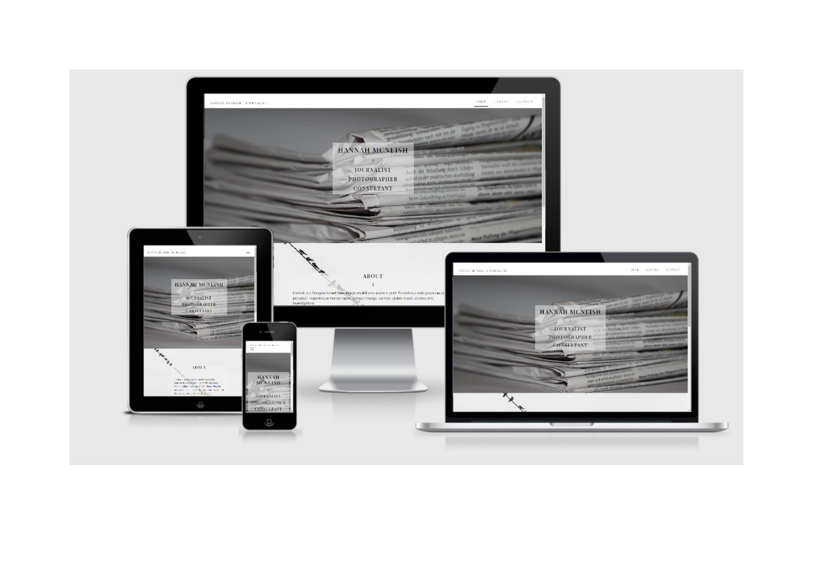

## Table of Contents
  * [Client Objectives](#client-objectives)
  * [Visitor Objectives](#visitor-objectives)
- [UX](#ux)
  * [Target Audience](#target-audience)
  * [User Stories](#user-stories)
    + [New users](#new-users)
    + [Potential Commissioners](#potential-commissioners)
    + [Returning Users](#returning-users)
- [Visuals](#visuals)
  * [Photography and Video Content](#photography-and-video-content)
  * [Fonts](#fonts)
  * [Colours](#colours)
  * [Wireframes](#wireframes)
- [Features](#features)
  * [Features across all pages](#features-across-all-pages)
    + [Home Page](#home-page)
    + [Library Page](#library-page)
    + [Contact Page](#contact-page)
  * [Existing Features](#existing-features)
  * [Features Left to Implement](#features-left-to-implement)
- [Technologies Used](#technologies-used)
- [Testing](#testing)
- [Manual Functionality Testing](#manual-functionality-testing)
  * [Issue and Fixes](#issue-and-fixes)
- [Deployment](#deployment)
  * [Deploying](#deploying)
  * [Forking](#forking)
  * [Cloning](#cloning)
- [Credits](#credits)
  * [Content](#content)
  * [Code](#code)
  * [Media](#media)
  * [Acknowledgements](#acknowledgements)

<small><i><a href='http://ecotrust-canada.github.io/markdown-toc/'>Table of contents generated with markdown-toc</a></i></small>

Live site can be found [here](https://janelleg51.github.io/Hannah-McNeish-Journalist/index.html)

## Hannah McNeish - Journalist
A website designed to consolidate the client’s body of work. This will allow users to learn about the client, view their work and submit enquiries relating to research, work requests and general enquires. Features include information about the client’s career, a library of the client's work and a contact page. The purpose is to generate business for the client and provide control over the any future additions of proprietary works such as blogs, vlogs and podcasts. 

The website has been designed to showcase the client’s work ensuring all visuals and features, such as navigation links and colours, are understated but complimentary to the content and context of the clients work. The target audience is those predominantly working in the media sector.

### Client Objectives
- To consolidate the client’s portfolio of work in one location. 
- To provide clear information of the types of services provided by the client. 
- To provide a visually pleasing experience showcasing previous work.
- To have the capacity to add new mediums of work in the future.
- To make it easy for general and media enquiries to be submitted.
- To allow for sponsorship and advertising opportunities on the site as a means of generating secondary income.

### Visitor Objectives
- As a visitor, I want to understand the work undertaken by the client at first glance.
- As a visitor, I want a visually pleasing positive experience.
- As a visitor, I want the visuals used to represent the context of the work.
- As a visitor, I want to be able to easily access the clients work.
- As a visitor, I want to be able to easily contact the client.

## UX

### Target Audience 
Those that work in the media and related industries are the primary target audience for this site as this will assist in achieving the goal of generating further work. However, those seeking to carry out research in the areas of the clients work and those with a general interest in the client's investigative areas are a close secondary audience.

### User Stories 

#### New users
1. As a new user, I would like to understand the sites purpose at first glance.
2. As a new user, I want to see the client’s work so I can decide if I would like to hire their services or make contact.
3. As a new user, I want the context of the work carried out by the client to be clear.
4. As a new user, I would like the sites navigation to be intuitive. 
5. As a new user, I expect control over video/media playback.
6. As a new user, I expect all images to be of high quality.
7. As a new user, I expect appropriate feedback for any interactive elements.

#### Potential Commissioners 
1.	As a potential commissioner, I want the site to be up to date.
2.	As a potential commissioner, I want to be able to follow the journalist’s social media channels.
3.	As a potential commissioner, I want the contact process to be easily visible and uncomplicated.
4.	As a potential commissioner, I expect to receive feedback when submitting the Contact Form.

#### Returning Users
1. As a returning user, I would like to be notified of any new content.

## Visuals 

### Photography and Video Content
The photography and video content used on this site are taken from [Getty Images](https://www.gettyimages.co.nz/photos/hannah-mcneish?family=editorial&phrase=hannah%20mcneish&sort=best#license) and [YouTube](https://www.youtube.com/results?search_query=hannah+mcneish) with the exception of the background images used on the [Home page](https://janelleg51.github.io/Hannah-McNeish-Journalist/index.html) and [Contact page](https://janelleg51.github.io/Hannah-McNeish-Journalist/contact.html). These images were taken from [Pixbay](https://pixabay.com/photos/news-newsletter-newspaper-1591767/) and [Unsplash.](https://unsplash.com/s/photos/birds-on-a-wire)
The client took all photography used on the Library page and all videos are open source. Videos remain the property of the commissioning media channel but display the reporting work of the client. Copyright infringement has not taken place. 

### Fonts
- The site uses **Playfair Display** font for all headings with a fall back of **‘sans-serif’**.
- **Raleway** is used for the body font with a fall back of **‘Arial’** then **‘sans-serif’**. 
- These fonts were choosen due to their closeness to the types of font used in print press as means of subconsciously conveying the work of the client.

### Colours
The use of colour throughout the site is minimal with the majority of colour coming from the clients own work, this is intentional. The colour that was used by the developer focussed mainly on black and white with gradients of grey. Again, to convey the feeling of print press and the media related work of the client. While traditional print press is becoming less common, the connection between the visual stimulus, in this case the fonts and the colours, and working in the media remain connected.
The colours used were:
- #fff - White
- #040404 - Black
- rgba(240, 240, 240, 0.3) Light Grey with opacity 
- rgb(239, 239, 239) Light Grey
- rgba(32, 28, 28, 0.315) Darker Grey 

### Wireframes
The Wireframe mockups were drafted using [Balsamiq](https://balsamiq.com/). These provided the foundation for the visual layout of the site with very few changes occuring throughout the build.

- [Home](wireframes/hannahhome.png)
- [Library](wireframes/hannahlibrary.png)
- [Contact](wireframes/hannahcontact.png)

## Features

### Features across all pages 
The site has two common features across all three pages, the **navigation bar** and the **footer**. The responsive navigation bar is fixed to the top of all pages keeping the name and role of the client visible at all times, as well as adding ease of navigation to any page on the site, [Home](https://janelleg51.github.io/Hannah-McNeish-Journalist/index.html), [Library](https://janelleg51.github.io/Hannah-McNeish-Journalist/library.html), [Contact](https://janelleg51.github.io/Hannah-McNeish-Journalist/contact.html). Each page link highlights when scrolled over and remains underlined on the active page to let visitors know which page they are currently viewing. 

The branding at the top left of the screen provides a link to the [Home](https://janelleg51.github.io/Hannah-McNeish-Journalist/index.html) page from any page on the site. On mobile devices, the navigation menu shifts to a drop down menu visible at the top of the screen at all times. 

The footer contains a **Contact Hannah** link that takes visitors to the [Contact Page](https://janelleg51.github.io/Hannah-McNeish-Journalist/contact.html) and has social media links to [Twitter](https://twitter.com/?lang=en-gb), [YouTube](https://www.youtube.com/), [LinkedIn](https://uk.linkedin.com/) and [SoundCloud](https://soundcloud.com/). Colours and fonts are consistent across all pages to ensure familiarity when navigating and a consistent theme across the site.

#### Home Page 
The [Home](https://janelleg51.github.io/Hannah-McNeish-Journalist/index.html) page has: 
- A full width hero image with a centred text overlay providing the clients name and the client’s occupation. The image chosen fulfils the immediate visual impression that the client works in media and sets the colour theme throughout the site. The text overlay provides immediate confirmation of the purpose of the site, which is to promote the client. 

- An About section after the hero image provides background to the client in terms of current location and the range of media and topical areas the client works in and reports on. The background image to the About section was chosen based on its inference to **‘wiring information’** and **‘lines of communication’** to keep the overt and covert media theme of the site consistent.
- Below the about section is a profile image of the client alongside a more detailed biography of work history and the types of commissioning agencies that the client has undertaken work for. Below this are links to redirect visitors to the **Library** or **Contact** page.

#### Library Page 
The [Library](https://janelleg51.github.io/Hannah-McNeish-Journalist/library.html) page consists of: 
- A ***centred Carousel*** displaying images of the clients work at the top of the page. 
- ***Three YouTube links*** contained in display cards sit below the carousel. These links are fully controlled by the user and can be played from their starting position in the card container or can be opened out to full screen – ***video does not auto play.***
- ***Six article links*** each contained within display cards. Each card contains a photo taken by the client that is relevant to the article, the name of the publisher and year of the publication, a brief abstract and a Read Article button to direct visitors to the article.
- Below this are ***eight cards inviting visitors to view more of the clients work***. Each card contains the logo of the site or publication the user would be directed to and a link button that takes visitors directly to the client’s work hosted on each site.

#### Contact Page 
The [Contact](https://janelleg51.github.io/Hannah-McNeish-Journalist/contact.html) page:

- Carries over the background image from the Home page About section and presents it across full width and height of the page.
- Has a simple, clearly visible contact form positioned centrally on the page.  Visitors are asked to complete their Full Name, Reason for Contact (Journalism, Photography, Consultancy or General), Email Address and Message then press Submit 
The form will not be submitted if the Full Name or Email Address fields are missing or incomplete. 

### Existing Features
**Branding** 

- Situated at the top left of the screen and present across all pages allowing users to navigate to home page from anywhere on the site.

**Navigation bar**
- Situated at the top right of the screen and present across all pages allowing users to navigate to any page on the site at any time. This also provides a visual to which page the user is currently viewing. Links shift to a dropdown menu on mobile devices which is present across all pages.
**

**Footer**
- Contains a Contact Hannah link and social media links to Twitter, YouTube, LinkedIn and SoundCloud and is situated on all pages.

**Home Page About** 
- Provides clear but brief information about the client including their location and areas of work.

**Home Page Biography**
- Provides more detail about the client’s work history and call to action buttons invite visitors to view more work or make contact.

**Library Page**

- Provides visitors with a view of the client’s work and each card contains a link button to read or view more, letting the visitor decide for themselves what they would like to view without crowding the page with every available piece of work.

**Contact Page**

- Provides a contact form to contact the client, options for reason for contact and a message facility.

### Features Left to Implement

- Confirmation email – send those that make contact a confirmation email thanking them for getting in touch and a response will be provided.
- Subscription - Allow visitors to subscribe to updates that will automatically notify subscribers of any new content.
- Future proprietary work - including blog, Podcast and radio work.
- Copyright information.
- Advertising - Real estate to include potential advertising.

## Technologies Used
- [HTML5](https://en.wikipedia.org/wiki/HTML5) was used to stucture the content on the site.
- [CSS3](https://en.wikipedia.org/wiki/CSS) was used to style the presentation of the content on the site.
- [Google Fonts](https://fonts.google.com/) provided the fonts for this site.
- [BootstrapCDN](https://getbootstrap.com/docs/5.0/getting-started/introduction/) V.5 Beta was used for this project to assist with the structure and responsiveness of the site. This included Bootstrap's [JavaScript](https://www.javascript.com/) and [Popper](https://popper.js.org/) plugins to assist with the carousel and navbar functions used on the site.
- [GitHub](https://github.com/join/get-started) provided the online storage space used to host and access all files and links associated with the site.
- [Gitpod](https://www.gitpod.io/) provided the cloud IDE used to build the site.
- [Balsamiq](https://balsamiq.com/) was used to create the wireframes for the site and provide the overall visual layout. 
- [Font Awesome](https://fontawesome.com/) provided the icons displayed on the site.
- [AutoPrefixer](http://autoprefixer.github.io/) was used to ensure that the CSS code was compatible across all browsers.
- [Pixabay](https://pixabay.com/) provided one copyright free image used on the site.
- [Unsplash](https://unsplash.com/) provided one copyright free image used on the site.
- [YouTube](https://www.youtube.com/) is the host of all video content displayed on the site.

## Testing 

The developer used [W3C CSS Validation](https://jigsaw.w3.org/css-validator/) Service and [W3C Markup Validation](https://validator.w3.org/) Service to check the validity of the site code.

User Stories testing:

New users
1.	As a new user, I would like to understand the sites purpose at first glance.
- The name and occupation of the client are the first visual a visitor sees when landing on the **Home** page of the site.
- If a user arrives at the site on any page other than the **Home** page, the **branding** at the top left of the screen also states the name and occupation of the client. This is **visible across all pages** and also links to the **Home** page.
2.	As a new user, I want to see the client’s work so I can decide if I would like to hire their services or make contact.
- The site has a **Library** page dedicated to the work of the client which is linked to through the **menu items at the top of the page** and in the client’s **biography section** on the Home page.
3.	As a new user, I want the context of the work carried out by the client to be clear.
- The **Home** page contains a brief **About section and Biography** of the client that clearly outlines the areas of work investigated and where in the world the client has been based.
- The **Library** page provides **abstracts** to explain the content of the articles on display allowing visitors to understand the context before proceeding any further.
4.	As a new user, I would like the sites navigation to be intuitive.
- The natural flow of the website is ***Home > Library > Contact*** and each page provides progressively more information about the work of client.
- Visitors **do not** need to scroll to the **top of the page** to access any page as they can be linked to through the fixed **navigation bar**, the **footer** and from the Home page **biography section**.
5.	As a new user, I expect control over video/media playback.
- Video content on the site **does not auto play** and the user has **full control** over the playback options.
6.	As a new user, I expect all images to be of high quality.
- All **background images** used are of the **appropriate resolution** and size for the their purpose. The client’s photography have been displayed relative to their **original rendering** to ensure **best presentation**. 
7.	As a new user, I expect appropriate feedback for any interactive elements.
- All video content **plays when selected**, the **Contact** form provides **confirmation feedback** and all **external links** open in a **separate page**.

Potential Commissioners

8.	As a potential commissioner, I want the site to be up to date.
- Content on the **Library** page is presented in **date order** and all new content will appear first. A **future feature** is to allow visitors to sign up to receive **email notifications** when **new content** is added.
9.	As a potential commissioner, I want to be able to follow the journalist’s social media channels.
- The client’s **social media** links can be accessed through the **Footer**, a feature that is present across all pages.
10.	As a potential commissioner, I want the contact process to be easily visible and uncomplicated.
- Links to the **Contact** page are present in the **navigation** bar menu items and **footer** across all pages, and below the biography on the **home** page.
- The **form** completion process has four fields asking the **minimum required information**.
11.	As a potential commissioner, I expect to receive feedback when submitting the Contact Form.
- On submitting the contact form, visitors are taken to a **confirmation page**.

Returning Users

12.	As a returning user, I would like to be notified of any new content.
- As new content is added to the site a **notification** will be added to the **Home** page. A future feature is to allow visitors to sign up to receive email notifications when new content is added.

## Manual Functionality Testing

Function | Purpose | Fulfilled
-------- | ------- | ---------
Navigation Bar | Branding at top left of screen redirects to Home page when clicked and this is consistent across all pages. | Yes
Navigation Bar | Menus items at top right of screen redirect to Home, Library and Contact pages. The active page is indicated by a solid line underneath. When hovered over, each link highlights with and underline for the duration of the hover. This is consistent across all pages.  | Yes
Navigation Bar | Menus items at top right of screen reduce to drop down menu on mobile devices. This is consistent across all pages. | Yes
Home Page Biography Links | Links redirect visitors to Library and Contact pages. Buttons change presentation when hovered over. | Yes
Library Page Carousel | Images at top of page scoll from left to right across all device sizes. | Yes
Library Page YouTube Links | Links do not autoplay and visitors have full control over playback, size and volume. | Yes
Library Page Article Links | All links contained within the article cards redirect the user to external pages where the article/s, images and further work are hosted. Buttons change presentation when hovered over. | Yes
Contact Page | Contains a form to allow visitors to contact the client if they wish. | Yes
Contact Form Validation | Visitors are unable to submit the form without completing the Full Name and Email fields. All other fields are optional. | Yes
Contact Form Confirmation | On submitting the contact form, visitors are redirected to a confirmation page thanking the for getting in touch. | Yes
Footer Contact Link | Contact Hannah link redirects visitors to the Contact page. This is consistent across all pages. | Yes
Footer Social Media Links | Background changes to white when hovered over and links take visitors to an external page for each specific site. This is consistent across all pages. | Yes
Responsiveness | Reduce and expand all pages to ensure each page responds as expected. Reducing or expanding the number of columns, pictures, text, forms, icons and video in line with the device size the site is being viewed on as expected. | Yes

**Lighthouse Results for Mobile (Incognito)**

Page | Performance | Accessibility | Best Practice | SEO 
-----|-------------|-------------- |---------------|-----
Home | 97 | 100 | 100 | 100
Library | 77 | 100 | 86 | 100
Contact | 98 | 100 | 100 | 100

**External Testing**

- The developer viewed the site across several devices. 
- The site was shared with a group of the developers peers.

All points are addressed in Issues and Fixes.

### Issue and Fixes

Issue | Fix |
------|-----|
Client's own images were not of high enough resolution or size to display full width. | Reduced the size of the carousel to match the original image size to improve presentation.
White panel appearing to right side of screen view after setting width, padding and gutters set to 0. | Changing hero image from image tag in html to CSS background image.
Site load time significantly reduced due to Bootstrap JavaScript CDN | The developer's knowledge is limited at this time but added ***defer*** to script to allow essential page content to parse first.
Menu item burger icon dropping below the branding on the navigation bar on screens <365px. | Added a media query to reduce the size of the branding on screens <365px.
Slight horizontal scroll occuring on mobile devices. | Added  overflow-x: hidden !important; to body and container fluid classes in CSS.
W3C Markup Validator returned errors on the Library page  ***Bad value auto for attribute width on element iframe: Expected a digit but saw a instead.*** | Setting a numerical value to the width of the iframe caused the video to spill out of the card container. Creating a fixed width meant the iframe was not responsive changes in size. The developer therefore deemed it better user experience to keep the width relative to the card it is contained in to keep it responsive across all devices.

## Deployment 
This site was developed using [Gitpod IDE](https://www.gitpod.io/), committed to git and pushed to [GitHub.](https://github.com/join/get-started) 

### Deploying
To deploy this site to **GitHub** pages, the steps below were taken:

1. The developer logged into **GitHub.**
2. Once logged in, the desired repository was selected from the options available to the left of the screen **JanelleG51-Hannah-McNeish-Journalist**
3. From the possible options available, which included **Code, Issues, Pull requests, Actions, Projects, Wiki, Security, Insights and Settings.** **Settings** was selected.
4. Once in **Settings**, scrolled down the page to **GitHub Pages**.
5. Under **Source**, clicked on the drop-down menu and changed the selection from **None** to **Master Branch**.
6. On selecting **Master Branch**, the page automatically refreshed and the site was deployed.
7. The deployed link then appeared in the **GitHub Pages** section. 

### Forking
Forking results in a **secondary branch** of the site being created. The **secondary branch** can be worked on simultaneously without the **Master Branch** being altered. The steps below should be followed:

1. Log into **GitHub.**
2. Select your desired repository from the options to the left.
3. From the options available at the top right of the screen, which include **Watch**, **Star** and **Fork**, select **Fork**.
4. A forked branch of the repository is then created. This is a copy of the repository up to the point the forked branch was created.
5. Changes can then be made in the forked repository without those changes taking effect in the **Master Branch**.
6. Both repositories can be merged by selecting **New Pull Request** from the original repository.

### Cloning
1. Log into **GitHub.**
2. Select your desired repository from the options to the left.
3. From the options available just above the commit list, which include **Go to File**, **Add File**, **Code** and **Gitpod**, select **Code**.
4. From the **HTTPS** tab, copy the **URL** for the repository.
5. Once in your **local IDE** open a new terminal.
6. Chose the working directory where you would like the cloned directory to be created.
7. Type **git clone** into the terminal and paste the **repository URL**.
8. Press **enter** to finish the cloning process.

## Credits

### Content 

- Backgroud images for this site were taken from [Pixabay](https://pixabay.com/) and [Unsplash](https://unsplash.com/). All other photography was taken by the client, Hannah McNeish.

### Code 

The developer sought guidance from various sources but credit must go to:
- [CSS-Tricks](https://css-tricks.com/design-considerations-text-images/) for the text overlay code for the site.
- [Bootstrap V5 Beta](https://getbootstrap.com/docs/5.0/getting-started/introduction/) for the navigation bar, carousel and display card HTML.
- Code Institute Love Running walkthrough for the social media icon styling.
### Media 

- All photography displayed on the Library page was taken by the client, Hannah McNeish.
- All video content is hosted on [YouTube](https://www.youtube.com/) but produced by the **BBC**, **INews24** and the **International Journalism Festival**.
### Acknowledgements

The developer is grateful for all guidance received throughout the development of this site with special thanks to Hannah McNeish, Victor Miclovich (Mentor) and the CI Slack Community.
